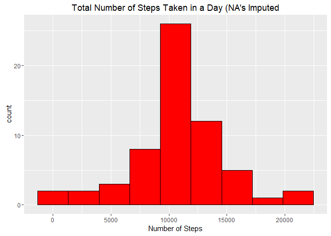

## Loading and preprocessing the data

```r
options(scipen = 1, digits = 2)
```


```r
require(knitr)
```

```
## Loading required package: knitr
```

```
## Warning: package 'knitr' was built under R version 3.3.3
```

```r
require(ggplot2)
```

```
## Loading required package: ggplot2
```


```r
if(!file.exists("activity.csv")) {
        unzip("activity.zip")
}
activity <- read.csv("activity.csv")
```


```r
activity$date <- as.Date(activity$date, "%Y-%m-%d")
```

## What is mean total number of steps taken per day?

```r
aggSteps <- tapply(activity$steps,activity$date,sum,na.rm=TRUE)
```


```r
qplot(aggSteps, bins = 9, xlab = "Number of Steps", 
      main = "Total Number of Steps Taken in a Day")
```

<!-- -->


```r
meanSteps <- mean(aggSteps)
medianSteps <-median(aggSteps)
```

The mean number of steps taken per day is 9354.23 and the median number of
steps taken per day is 10395.

## What is the average daily activity pattern?

```r
intSteps <- tapply(activity$steps,activity$interval,mean,na.rm=TRUE)
```


```r
plot(names(intSteps),intSteps,type = "l", col = "blue", 
     xlab = "Interval (minutes)", ylab = "Number of Steps", 
     main = "Average Number of Steps in Each 5 Minute Inerval")
```

<!-- -->


```r
maxSteps <- max(intSteps)
maxInt <- names(intSteps[which(intSteps == maxSteps)])
```

The interval with the most average steps is 835 during which an average
of 206.17 are taken.

## Imputing missing values

```r
colSums(is.na(activity))
```

```
##    steps     date interval 
##     2304        0        0
```

```r
countNA <- sum(is.na(activity$steps))
```

There are 2304 observations that have an NA value listed.

In order to account for activity in intervals nearby to a missing value and for
usual movement at a given time of day, we find the mean of the intervals
immediately before and after the missing interval and find the mean of the
given interval across all days in the dataset. We then take the mean of these
two numbers to replace the NA value with. If both values around the interval
are also NA, the value is computed from the daily interval mean only.

```r
modAct <- activity$steps
modAct[c(1,17568)] <- intSteps[c(1,288)]
for (i in 2:17567){
        if (is.na(modAct[i])){
                near <- mean(c(activity$steps[i-1],activity$steps[i+1]))
                if (is.na(near))
                        modAct[i] <- intSteps[which(activity$interval[i]==names(intSteps))]
                else
                        modAct[i] <- mean(c(near,intSteps[which(activity$interval[i]==names(intSteps))]))
        }
}
newAct <- activity
newAct$steps <- modAct
```


```r
newAggSteps <- tapply(newAct$steps,newAct$date,sum,na.rm=TRUE)
```


```r
qplot(newAggSteps, bins = 9, xlab = "Number of Steps", 
      main = "Total Number of Steps Taken in a Day (NA's Imputed")
```

<!-- -->


```r
meanNewSteps <- mean(newAggSteps)
medianNewSteps <-median(newAggSteps)
```

The mean number of steps taken per day is 10766.19 and the median number
of steps taken per day is 10766.19. It is clear that both the mean and
the median number of steps has increased when replacing the NA values. Obviously
adding in more values will only increase the estimates of total daily number of
steps. A side effect is that it has made the distribution more normal since
there were some days where all of the values were NA and thus were summed to 0
before. Those days will be right on the mean number of steps now.

## Are there differences in activity patterns between weekdays and weekends?
