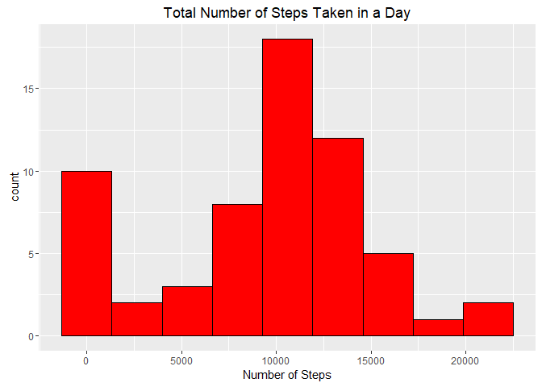

## Loading and preprocessing the data

```r
require(xtable)
```

```
## Loading required package: xtable
```

```
## Warning: package 'xtable' was built under R version 3.3.3
```

```r
require(knitr)
```

```
## Loading required package: knitr
```

```
## Warning: package 'knitr' was built under R version 3.3.3
```


```r
if(!file.exists("activity.csv")) {
        unzip("activity.zip")
}
activity <- read.csv("activity.csv")
```


```r
activity$date <- as.Date(activity$date, "%Y-%m-%d")
```

## What is mean total number of steps taken per day?

```r
aggSteps <- tapply(activity$steps,activity$date,sum,na.rm=TRUE)
```


```r
hist(aggSteps, breaks = 10, xlab = "Number of Steps", 
     main = "Total Number of Steps Taken in a Day")
```

<!-- -->


```r
meanSteps <- mean(aggSteps)
medianSteps <-median(aggSteps)
```

The mean number of steps taken per day is 9354.2295082 and the median number of
steps taken per day is 10395.

## What is the average daily activity pattern?


## Imputing missing values


## Are there differences in activity patterns between weekdays and weekends?
